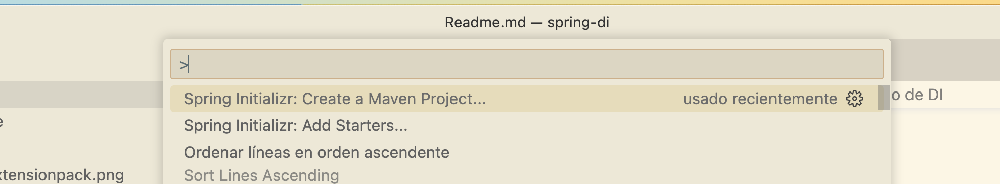
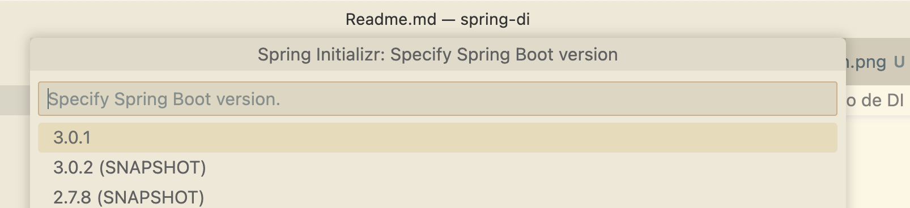
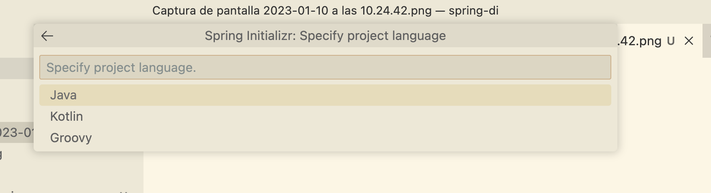
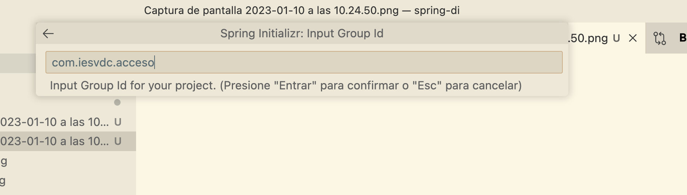
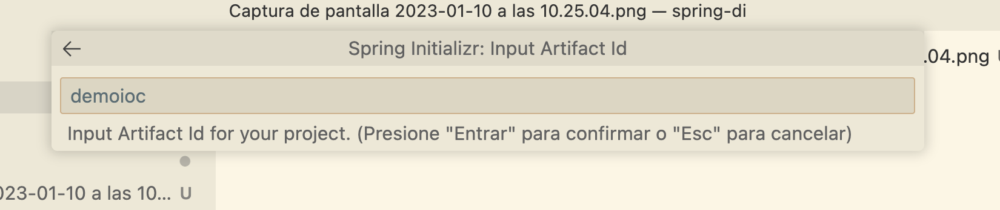
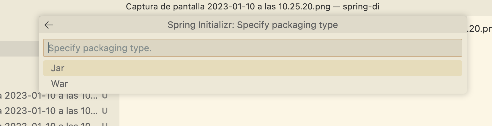
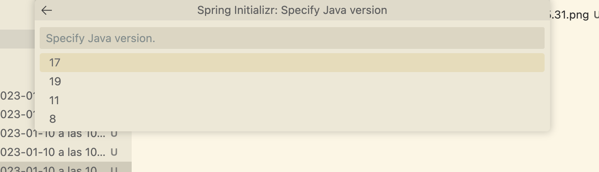
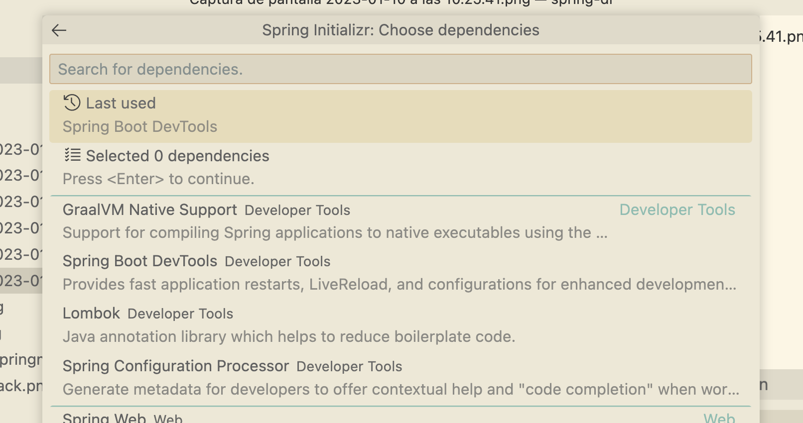

# Inyección de Dependencias con Spring

¿Por qué usamos el framework Spring? Spring nos ayuda a automatizar muchas tareas de "calentar el plato" o *boilerplate*.

Spring nos permite desarrollar aplicaciones de manera más rápida, eficaz y corta, saltándonos tareas repetitivas y ahorrándonos lineas de código.

## Prerrequisitos

Necesitamos tener instalada una [JDK](http://jdk.java.net/14/) y [Maven](http://maven.apache.org) en el equipo y accesible en la variable PATH del sistema operativo. Dependiendo del sistema operativo, es posible instalarlos desde las diferentes herramientas (ej. apt en Debian, brew en MAC....) sin tener que buscar en Internet.

Vamos a trabajar con VisualStudio Code y necesitamos tener instalados los plugins siguientes:

**Java Extension Pack**


**Spring boot Extension Pack**


**Markdown All in One**


## Puntos clave de Spring

* **Inversion de Control (IoC)**: básicamente de lo que se trata es de invertir la forma en que se controla la aplicación, lo qué antes dependía del programador, una secuencia de comandos desde alguno de nuestros métodos, ahora depende completamente del framework, con la idea de crear aplicaciones más complejas y con funcionamientos más automáticos.
* **Inyección de dependencia (DI)**: el manejo de las propiedades de un objeto son inyectadas a través de un constructor, un setter, un servicio, etc. 

## Creación del proyecto tipo

Para la creación del proyecto nos vamos a la paleta de comandos y cremos un proyecto Spring con Maven:



Al pulsar **enter** podemos seleccionar la versión de Spring boot que queremo usar, seleccionamos la última en nuestro caso.



Seguidamente seleccionamos el lenguaje de programación que queremos usar, en nuestro caso nos decantamos por Java:



Ya podemos indicar el grupo (paquete) donde va a estar nuestra aplicación:



Tras el paquete, hay que introducir el nombre de nuestro artefacto (aplicación):



Luego el tipo de empaquetado, como es una aplicación Spring Boot usaremos **JAR**, pues no necesitamos un servidor de aplicaciones, lleva embebido un Tomcat:



A continuación seleccionamos la versión de Java, donde selecionaremos 17 por ser la última LTS liberada a día de hoy:



En este proyecto *tonto* no necesitamos añadir ninguna dependencia a nuestro proyecto Maven, así que simplemente pulsamos enter en la selección de las mismas:



# Ejemplo de DI

En la carpeta **resources** Spring busca por recursos para utilizar en el proyecto (por ejemplo, configuración de los DataSources, seguridad, etc.).

En dicha carpeta crearemos un fichero llamado beans.xml con la siguiente estructura:

```xml
<?xml version="1.0" encoding="UTF-8"?>
<beans xmlns="http://www.springframework.org/schema/beans"
    xmlns:xsi="http://www.w3.org/2001/XMLSchema-instance"
    xsi:schemaLocation="http://www.springframework.org/schema/beans http://www.springframework.org/schema/beans/spring-beans.xsd">
    <!-- aquí van nuestras beans -->
</beans>
```

Esta será la estructura genérica que siempre tendrá nuestro archivo de beans. Ahora dentro, ya podemos crear elementos a los que Spring hará su magia y los convertirá en objetos en tiempo de ejecución, por ejemplo, si dentro del archivo creamos el bean:

```xml
<bean id="mi_moto" class="com.iesvdc.acceso.beans.Moto">
    <property name="marca" value="Harley Davidson"></property>
    <property name="modelo" value="SportSter 1200"></property>
</bean>
```

Desde la aplicación Spring Boot podremos leerlo así:

```java
public class App 
{
    public static void main( String[] args )
    {
        ApplicationContext ac = 
            new ClassPathXmlApplicationContext("com/iesvdc/acceso/xml/beans.xml");
        Moto miMoto = (Moto) ac.getBean("mi_moto");
        System.out.println(miMoto.toString());
    }
}
```

## Cómo ejecutar una aplicación Spring Boot desde CLI

Para invocar la aplicación desde Maven bastará con escribir desde la raíz del proyecto la siguiente orden:

```bash
mvn spring-boot:run
```