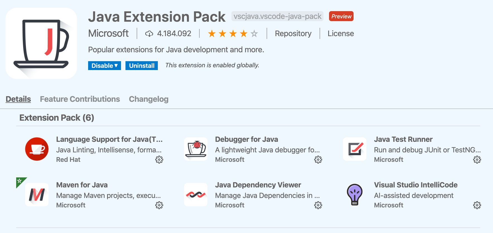
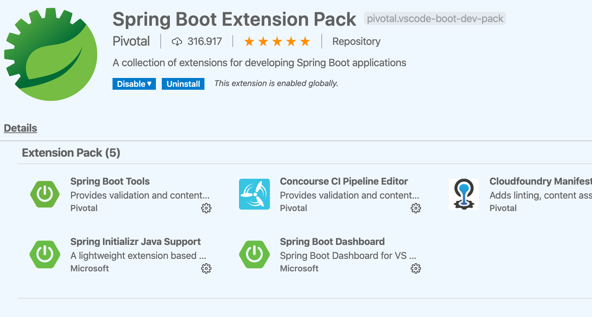
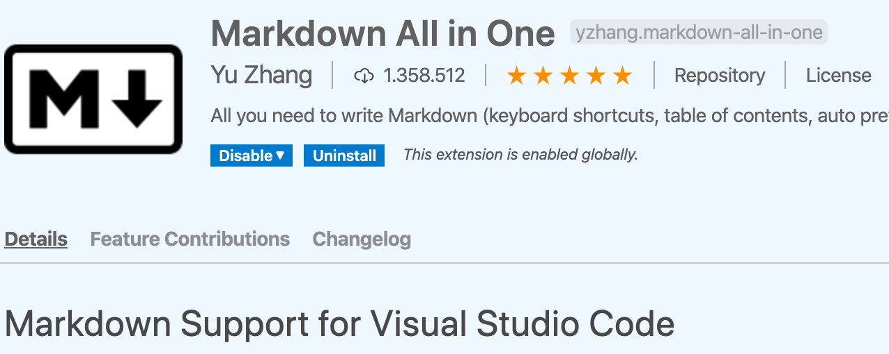

# Inyección de Dependencias con Spring

¿Por qué usamos el framework Spring? Spring nos ayuda a automatizar muchas tareas de "calentar el plato" o *boilerplate*.

Spring nos permite desarrollar aplicaciones de manera más rápida, eficaz y corta, saltándonos tareas repetitivas y ahorrándonos lineas de código.

## Prerrequisitos

Necesitamos tener instalada una [JDK](http://jdk.java.net/14/) y [Maven](http://maven.apache.org) en el equipo y accesible en la variable PATH del sistema operativo. Dependiendo del sistema operativo, es posible instalarlos desde las diferentes herramientas (ej. apt en Debian, brew en MAC....) sin tener que buscar en Internet.

Vamos a trabajar con VisualStudio Code y necesitamos tener instalados los plugins siguientes:

**Java Extension Pack**

**Spring boot Extension Pack**

**Markdown All in One**

## Puntos clave de Spring

* **Inversion de Control (IoC)**: básicamente de lo que se trata es de invertir la forma en que se controla la aplicación, lo qué antes dependía del programador, una secuencia de comandos desde alguno de nuestros métodos, ahora depende completamente del framework, con la idea de crear aplicaciones más complejas y con funcionamientos más automáticos.
* **Inyección de dependencia (DI)**: el manejo de las propiedades de un objeto son inyectadas a través de un constructor, un setter, un servicio, etc. 

## Ejemplo de DI

Creación del proyecto:

